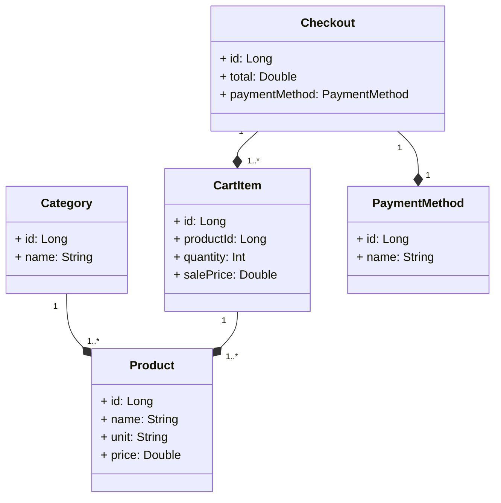

# mermaid

```mermaid
classDiagram


  class Category {
    + id: Long
    + name: String
  }

  class Product {
    + id: Long
    + name: String
    + unit: String
    + price: Double
  }

  class CartItem {
    + id: Long
    + productId: Long
    + quantity: Int
    + salePrice: Double
  }

  class Checkout {
    + id: Long
    + total: Double
    + paymentMethod: PaymentMethod
  }

    class PaymentMethod {
    + id: Long
    + name: String
  }

  Category "1" --* "1..*" Product
  CartItem "1" --* "1..*" Product
  Checkout "1" --* "1..*" CartItem
  Checkout "1" --* "1" PaymentMethod


```
